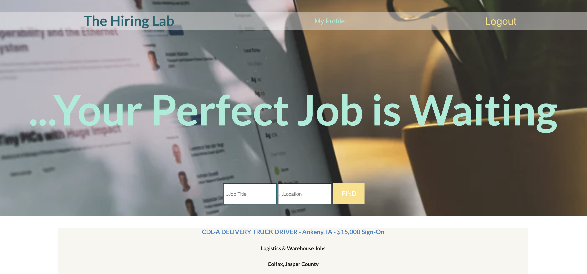
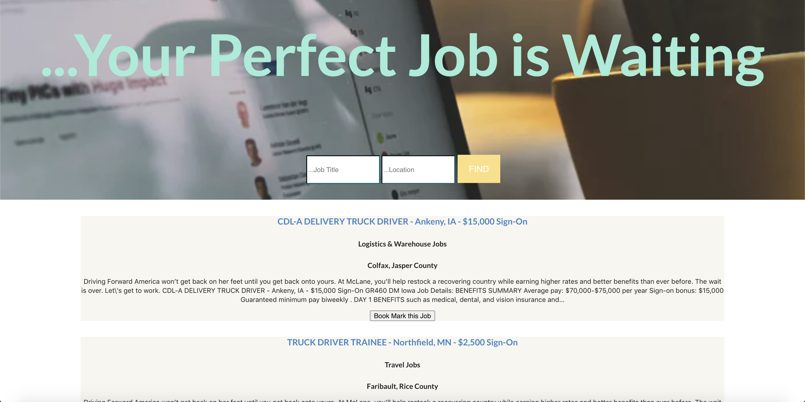

## The Hiring Lab 

As my final project for SEI I decided to try my hand at using an API. I used the Adzuna job board aggregator API which allows users to search for jobs in fields they are interested in, by location and job title.

## Screenshots

---

## Technologies Used
* React
* Node
* Express.js
* HTML/CSS/Javascript
* Adzuna Job Board API
* MongoDB
* Mongoose 

## Getting Started 
Check out The Hiring Lab here: [The Hiring Lab](https://the-hiring-lab.herokuapp.com/)

The Trello Board used for this app: [The Hiring Lab Trello Board](https://trello.com/b/o6bIdvJJ/project-4-final-project)

## IceBox features 

* Allow users to bookmark and un-bookmark jobs they like

